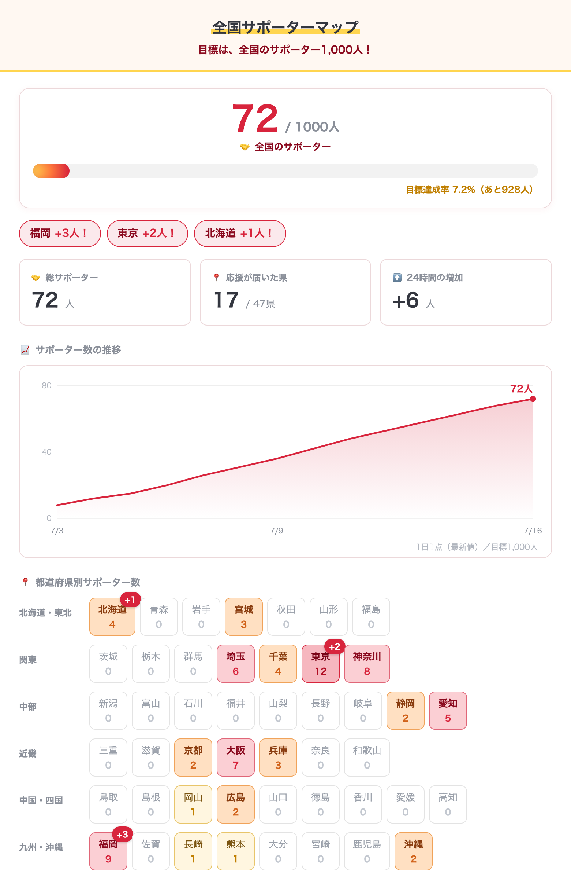

# サポータートラッカー（テンプレート）

都道府県別のサポーター数を集計して見せる、無料の応援トラッカーです。
このリポジトリを**テンプレートとして複製**すれば、誰でも自分専用のトラッカーを作れます。



## できること
- 🤝 **目標人数ゲージ**（例：サポーター1,000人への進捗バー）
- 📈 **サポーター数の推移グラフ**（日別）
- ⬆️ **24時間で増えた県を「福岡 +3人！」と演出**
- 📍 **都道府県別タイル**（人数が多いほど色が濃い）

## 仕組み
```
Googleシート（報告フォームの「都道府県」列）
  → Apps Script が {prefs:{都道府県:人数}, goal} を返す
  → GitHub Actions が 30分おきに取得・24h差分計算・グラフ用に記録
  → HTML/PNG を生成してリポジトリに書き戻す
  → GitHub Pages で公開（ で外部サイトにも貼れる）
```
**自分のMacを起動しておく必要はありません**（更新はすべてGitHubのクラウド上）。

## 作り方
👉 **[SETUP.md](SETUP.md) の手順どおりに進めてください**（15〜20分・GitHubアカウントがあれば無料）。

🤖 **Claude Code などのAIアシスタントに任せる場合**は、[SETUP-AI.md](SETUP-AI.md) を読ませてください。リポジトリ作成〜公開〜自動更新の確認まで代行できます。

## ローカルで見た目だけ確認したい場合
```bash
node build.js                 # data.json から HTML を生成
node scripts/render_png.js    # PNG プレビューを書き出し（要 npx playwright install chromium）
```
`data.json` を手で書き換えれば、シートを繋がなくても表示を試せます。
